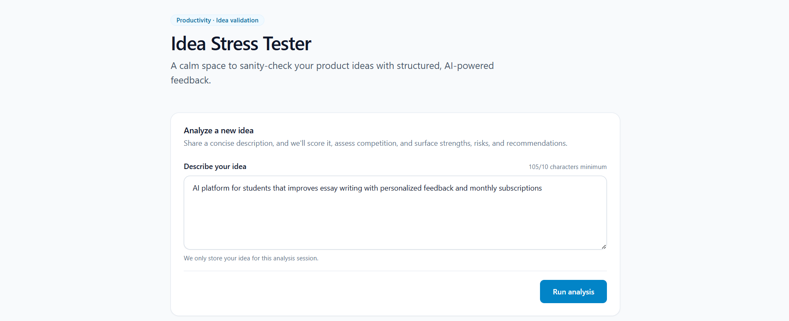
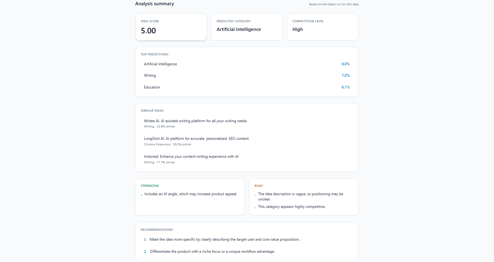

# Idea Stress Tester

Idea Stress Tester is a full-stack machine learning application that evaluates startup ideas and provides structured feedback.  
It analyzes an idea description, predicts its category, estimates competition, scores clarity, and suggests improvements.

The system combines an ML classifier with heuristic analysis to simulate a lightweight **idea validation tool**.

---

## Features

- ML-based startup idea classification
- Idea quality scoring
- Competition level estimation
- Business signal detection (AI, platform, marketplace, etc.)
- Similar product discovery
- Strengths, risks, and improvement recommendations
- Validation of weak or meaningless input
- Clean frontend UI for interactive analysis

---

## Demo




Input example:

AI platform for students that improves essay writing with personalized feedback and monthly subscriptions

Example output:

- Category: Artificial Intelligence
- Idea Score: 5.01
- Competition Level: High
- Similar ideas found
- Strengths and risks analysis
- Recommendations for improvement

---

## Tech Stack

### Backend

- Python
- FastAPI
- scikit-learn
- pandas
- joblib

### Machine Learning

- TF-IDF vectorization
- Logistic Regression classifier
- Cosine similarity search
- Feature-based scoring heuristics

### Frontend

- Next.js
- TypeScript
- Tailwind CSS
- Framer Motion

---

## Project Architecture

```text
idea-stress-tester/

app/              # FastAPI backend
ml/               # training scripts
frontend/         # Next.js frontend
data/             # datasets
artifacts/        # trained models
```

### ML Pipeline

```text
dataset
↓
preprocessing
↓
TF-IDF vectorizer
↓
Logistic Regression classifier
↓
idea analysis pipeline
```

---

## API Endpoints

### Analyze Idea

```http
POST /analyze
```

Request:

```json
{
  "idea": "AI platform for students that helps improve essay writing"
}
```

Response includes:

- predicted category
- confidence score
- idea score
- competition level
- strengths
- risks
- recommendations
- similar ideas

---

### Model Info

```http
GET /model-info
```

Returns model metrics and dataset statistics.

---

### Categories

```http
GET /categories
```

Returns available idea categories and dataset counts.

---

## Running the Project

### 1. Clone the repository

```bash
git clone https://github.com/YOUR_USERNAME/idea-stress-tester.git
cd idea-stress-tester
```

---

### 2. Backend setup

Install dependencies:

```bash
pip install -r requirements.txt
```

Run FastAPI server:

```bash
uvicorn app.main:app --reload
```

API documentation will be available at:

```text
http://127.0.0.1:8000/docs
```

---

### 3. Frontend setup

```bash
cd frontend
npm install
npm run dev
```

Frontend will run at:

```text
http://localhost:3000
```

---

## Training the Model

Prepare dataset:

```bash
python ml/prepare_dataset.py
```

Train model:

```bash
python ml/train_model.py
```

Artifacts will be saved in:

```text
artifacts/
```

---

## Example Analysis Flow

```text
User enters idea
↓
Frontend sends request to FastAPI
↓
ML classifier predicts category
↓
Scoring heuristics evaluate idea clarity
↓
Similar ideas retrieved via cosine similarity
↓
Backend returns structured analysis
↓
Frontend displays results dashboard
```

---

## Possible Improvements

- Larger training dataset
- Transformer-based embeddings
- Vector database for idea similarity
- Market data integration
- Idea viability prediction models
- User accounts and idea history

---

## Author

Created as a machine learning portfolio project demonstrating:

- ML model deployment
- FastAPI backend architecture
- full-stack ML application development
- ML-driven product analysis

---

## License

MIT License
